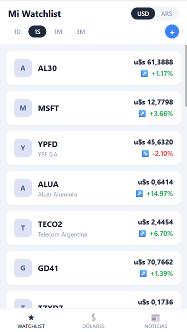

# Assets Tracker

Aplicación web para seguimiento de activos financieros del mercado argentino. Muestra precios en ARS y USD, variaciones por período, cotizaciones del dólar y noticias del mercado.



## Funcionalidades

- **Watchlist** — lista de activos con precio actual en ARS/USD y variación configurable (1D, 1S, 1M, 3M)
- **Detalle de activo** — precio actual y grilla de variaciones por los cuatro períodos
- **Dólares** — cotizaciones oficial, blue, bolsa y CCL con variación histórica
- **Noticias** — feed de noticias del mercado con resumen en markdown por nota
- **Agregar/quitar tickers** — alta y baja de activos en tiempo real

## Tecnologías

- React + TypeScript + Vite
- Zustand (estado global)
- React Router
- Vitest (tests unitarios)

## Requisitos

Requiere el backend [investorData](https://github.com/marcosm121/investorData) corriendo en `http://localhost:3000` (o configurar `VITE_INVESTOR_DATA_URL` en `.env`).

## Desarrollo

```bash
npm install
npm run dev       # servidor de desarrollo con hot reload
npm test          # tests unitarios
npm run build     # build de producción
npm run lint      # linter
```
